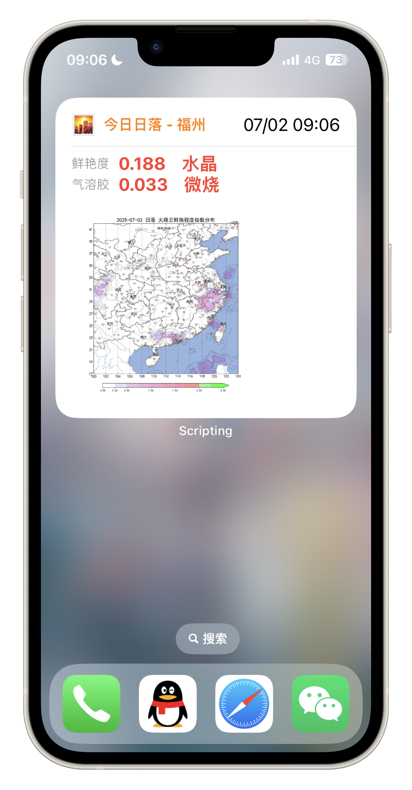
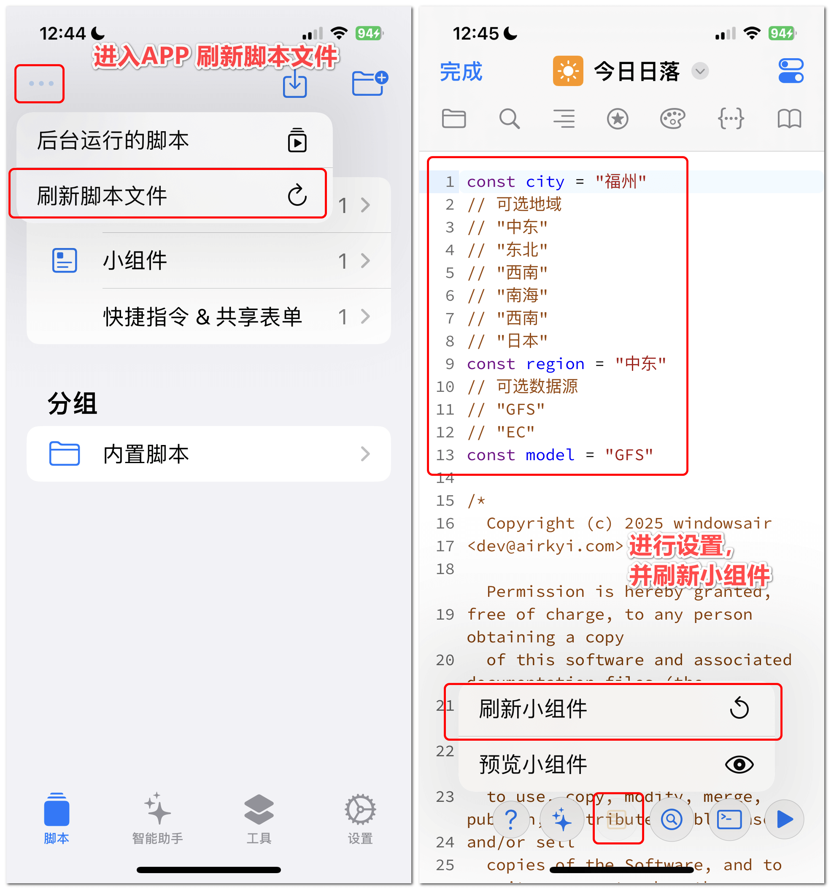

    

<h1 align="center">🌇今日日落</h1>

基于 sunsetbot 和 Scripting 的火烧云预测 iOS 小组件

## 使用

1. 安装 [Scipting](https://apps.apple.com/cn/app/scripting-ai%E7%BC%96%E7%A8%8B%E5%8A%A9%E6%89%8B/id6479691128), 下载脚本并导入：

    https://github.com/windowsair/TodaySunset/releases

    

2. 修改配置

    

3. 添加小组件

    

## Credit

- https://sunsetbot.top/